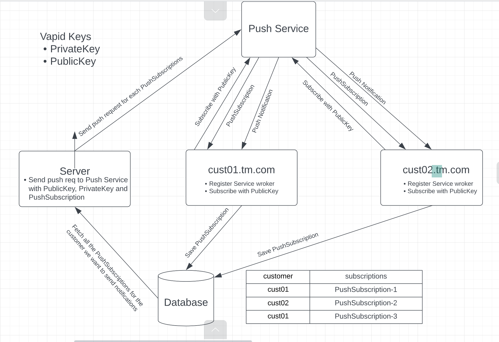

To run the server: **npm run start**

#### Services Used:
    * web-push:
        * Open-source
        * Supported by Chrome, Microsoft Edge, Firefox, etc

#### The flow diagram of push notification

####  Steps involved:
    •	Create Vapid keys. It has public key and private key
    •	Each browser has it’s own Push Service

#### In client side:
    •	Register service-worker
    •	Subscribe to push notification using the public vapid Key
    •	On subscribing, we’ll receive a PushSubscription, we’ll send this PushSubscription in the backend to be stored in database
    •   In the homepage we have button to subscribe to push notification
    •   To send push notifications, go to page /sendNotifications.html
    •   To send topic push notifications, go to page /sendTopicNotifications.html

#### Server-side
    •	Create api to receive PushSubscription which is to be stored in database (mapped with customer type)
    •	For sending push notifications for any customer type, fetch all the PushSubscriptions for that customer and send push notification request to Push Service using private and public vapid keys.
    --------
    Apis:
        •   /subscribe: This api recieves subscription data and store that in Subscriptions table in database.  For topic subscriptions, we'll recieve additional paramter which hold topics. we store that in Topics table
        •   /sendNotifications: This api send notifications for all subscribers of a customer
        •   /sendTopicNotifications: This api send notifications for all subscribers of a customer subscribed to a particular topic
        •   /removeSubscription: On unsubscribing, this api removes the subscription from database.

#### Supported browsers:
    •	Google Chrome
    •	Microsoft Edge
    •	Mozilla Firefox
    •	Safari:
        o	Mac: Supported in Safari 16 in Mac OS 13 or later
        o	iOS: Support for web-push in safari will be available in iOS 16 by 2023

